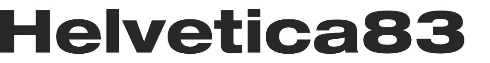
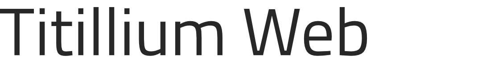

# My secret vault of Design & Frontend/UI resources!
These are the things I have in my bookmarks and use everyday. I hope you'll find use for them aswell :)

## General
* [PNGPixel](https://png-pixel.com/) - Convert Images to base64
* [ColorsAndFotnts](https://www.colorsandfonts.com/) - A collection of colors, fonts and more
* [IconScout](https://iconscout.com/) - Icons, Illustrations and stock photos in one place

## Javascript
* [moveable](https://github.com/daybrush/moveable) - A library for movable/resizable etc. HTML Elements
* [Code snippet how to let users paste from clipboard](https://stackoverflow.com/questions/6333814/how-does-the-paste-image-from-clipboard-functionality-work-in-gmail-and-google-c)
* [keycode.info](https://keycode.info/) - Quickly get keyboard input codes
* [HTML DOM.](https://htmldom.dev/) - Super useful snippets to modify DOM elements with Vanilla JS 

### Templating engines for express.js
* [Pug](https://pugjs.org/api/getting-started.html)
* [ejs](https://ejs.co)
* [express-handlebars](https://www.npmjs.com/package/express-handlebars)

## Layout
* [csslayout](https://csslayout.io/patterns/) - Pre-made CSS elements using flex
* [tailblocks](https://mertjf.github.io/tailblocks/) - Pre-made components for tailwind
* [CSS Flexbox generator](https://flexgenerator.com/) - Great for grids and item streams
* [CSS Grid generator](https://cssgrid-generator.netlify.app/) - Great for layouts that uses some fixed values and some not - e.g. layout with sidebar & footer etc.

## Icons
* [Iconoir](https://iconoir.com/) - Over 2000 Icons beautiful rounded Icons in 3 styles
* [MyIcons](https://myicons.co) - Probably my favorite Icons. 80$ for the whole 5200+ Icon Pack
* [Iconify](https://iconify.design/) - Tiny, universal icon loader (You can also discover a lot of cool icons there)
* [Iconly Essential](https://ui8.net/piqodesign/products/iconly-essential-icons) - 500 (free) essential Icons
* [Design Essentials 2](https://ui8.net/aps/products/design-essentials-2) - over 400 great Icons for 16$
* [Carbon Icons](https://www.carbondesignsystem.com/guidelines/icons/library/)
* [Remix Icons](http://remixicon.com/)
* [Ikonate](https://ikonate.com/)
* [Icons8 Animated Icons](https://icons8.com/animated-icons)
* [System UIcons](https://systemuicons.com/)
* [Unicons Line](https://iconscout.com/unicons/explore/line)
* [Box Icons](https://boxicons.com/)
* [MaterialDesignIcons](https://materialdesignicons.com) - A collection of Google's Material icons plus hundreds of community-made ones
* [MaterialDesignIcons Light](https://creativemarket.com/templarian/348441-Material-Design-Icons-Light)
* [IonIcons](https://ionicons.com/)
* [Tabler Icons](https://tablericons.com/)
* [Feather Icons](https://feathericons.com/)
* [Simple Icons](https://simpleicons.org/)
* [Icons8](https://icons8.com)
* [Zwicon](https://www.zwicon.com)
* [Simple Icons](https://simpleicons.org) - All the brand logos
* [Octicons](https://octicons-primer.vercel.app/octicons)

## Illustrations
* [Isometric love](https://www.isometriclove.com/) - Smooth isometric 3d objects
* [Isometric.online](https://isometric.online/) - Modern isometric 3d illustrations
* [Lottie](https://lottiefiles.com/popular?sort=all-time) - Animated Icons, Illustrations ans Micro-Interactions
* [IRA Design](https://iradesign.io) - Customizable, generatied gradient illustrations
* [ManyPixels](https://www.manypixels.co/gallery/) - More CUstomizable Illustrations in various different styles

## Color Themes
* [HalfMoon Palette](https://www.gethalfmoon.com/docs/color-utilities/)

## Gradients
* [MeshGradients](https://www.ls.graphics/meshgradients)
* [Grabients](https://www.grabient.com/)
* [GradientMagic](https://www.gradientmagic.com/) - Background patterns with css gradients
* [WebGradients](https://webgradients.com/)
* [CSSGradient](https://cssgradient.io/) - CSS Gradient Generator
* [UIGradient](https://uigradients.com/)

## SVG
* [Yoksel URL-Encoder](https://yoksel.github.io/url-encoder/) - Converts SVGs into In-line HTML SVGs
* [SVGBackgrounds](https://www.svgbackgrounds.com/) - Tiny customizable background patterns
* [HeroIcons Patterns](https://heropatterns.com/) - SVG background patterns
* [GetWaves](https://getwaves.io) - Customizable SVG Waves
* [BlobMaker](https://www.blobmaker.app) - The same tool, but for blob shapes.
* [Haikei.app](https://haikei.app) - A collection of tools to generate interesting and fun shapes and effects, including the two above

## Images
* [Dante Metaphor on BeHance](https://www.behance.net/dantemetaphor) - Creates futuristic, modern and metall-ish wallpapers and logos
* [Pexels](https://pexels.com) - Royalty Free high quality stock photos
* [Unsplash](https://unsplash.com) - Free HD stock photos
* [Icons8 Upscaler](https://icons8.com/upscaler) - AI-Powered image upscaler
* [Transparenttextures](https://www.transparenttextures.com) - Great textures for use with background blending etc.

## UI Kits
* [UIStore Design](https://www.uistore.design)

## Fonts
* [Google Fonts](https://fonts.google.com/)
* [Rostype](http://rostype.com) - Custom font designers with a few small but nice freebies
* [Stefano Giliberti](https://www.brumale.xyz/) - A talented font designer with some freebies
* [FontFabric](https://www.fontfabric.com/) - Font designers with great free fonts and good paid offers
* 

  
My personal favorite fonts

     <h2>Header Fonts</h2>
    <ul>
      <li>
        

        
Helvetica 83 Wide

          
          <a href="https://www.fonts.com/font/linotype/neue-helvetica/83-extended-heavy">Buy</a>  
        

      </li>
      <li>
        

        
Do Hyeon

          
          <a href="https://fonts.google.com/specimen/Do+Hyeon">Download</a>  
        

      </li>
      <li>
        

        
URW Geometric

          
          <a href="https://www.myfonts.com/fonts/urw/geometric/">Buy</a>  
        

      </li>
    </ul>
     <h2>Text Block Fonts</h2>
    <ul>
      <li>
        

        
San Francisco Display

          
          <a href="https://developer.apple.com/fonts/">Download</a>  
        

      </li>
      <li>
        

        
Sequel Sans

          
          <a href="https://www.myfonts.com/fonts/ogj-typedesign/sequel-sans/">Buy</a>  
        

      </li>
      <li>
        

        
Titillium Web

          
          <a href="https://fonts.google.com/specimen/Titillium+Web">Download</a>  
        

      </li>
      <li>
        

        
Poppins

          
          <a href="https://fonts.google.com/specimen/Poppins">Download</a>  
        

      </li>
    </ul>
     <h2>Serif Fonts <small><i>(Goes best with Headings)</i></small></h2>
    <ul>
      <li>
        

        
New York

          
          <a href="https://developer.apple.com/fonts/">Download</a>  
        

      </li>
      <li>
        

        
Sparkling Moscow

          
          <a href="https://creativemarket.com/sensatype/4422537-Sparkling-Moscow-Font-Duo">Buy</a>  
        

      </li>
      <li>
        

        
Trajan Pro 3

          
          <a href="https://www.azfonts.de/load_font/trajan-pro-3.html">Download</a>  
        

      </li>
      <li>
        

        
Winchester

          
          <a href="https://www.dafont.com/winchester-2.font">Download</a>  
        

      </li>
    </ul>
  
  
